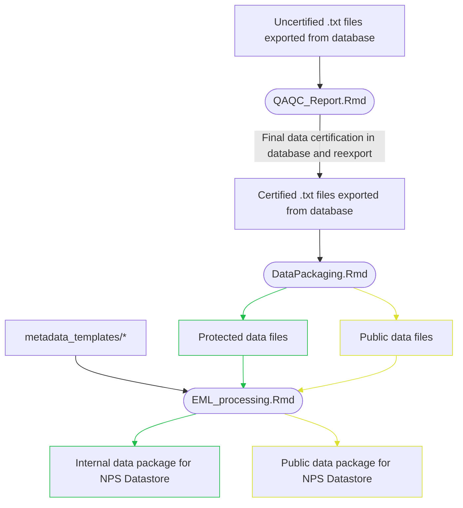

# SWNC-grasslands-data-prep

This repository includes scripts for the QA/QC and data packaging for 
the National Park Service Southern Plains Network Grasslands Monitoring protocol.

## File and Folder Descriptions

These are brief descriptions for the files and directories inside this repo. The scripts contain more detailed descriptions of themselves.

- EML_processing.Rmd: Generates an .xml metadata file for the .csv files generated by Data_Packaging.Qmd. The output file will be a part of the published data package.
- Data_Packaging.Qmd: Generates .csv flat files for data packages.
- QAQC_Report.Rmd: QA/QC script for the data. Used for certification, before publication or analysis.
- .Renviron: Not included in repo, because it includes file paths. Lists variables necessary to run most scripts in this repository. See below for template.
- .Rprofile: Imports variables from .Renviron into the R environment.
- metadata_templates/: Templates that are used in EML_processing.Rmd to create a metadata file for the data package.

## Workflow



## .Renviron template

Create a file named ".Renviron" in your local clone of the repo. Copy the template below and fill in the appropriate paths and values. The paths should end with a forward slash.

```bash
# used across scripts
start_year=XXXX                 # first year for period of interest
end_year=XXXX                   # last year for period of interest
dbExports=""                    # directory containing .txt files exported from database
dbExportDate="YYYYMMDD"         # date that the data were exported from the database (e.g., "20260808")

# QAQC
PlotSpeciesExports=""           # directory to export an Excel file containing all plant species observed across plots

eval_sampling_events=TRUE       # logical. whether to create QAQC tables for the sampling events.
eval_lpi=TRUE                   # logical. whether to create QAQC tables for the line-point intercept data.
eval_trees=TRUE                 # logical. whether to create QAQC tables for the tree data.
eval_circ_quad=TRUE             # logical. whether to create QAQC tables for the circular quadrat data.
eval_divided_quad=TRUE          # logical. whether to create QAQC tables for the divided quadrat data.
eval_new_species=TRUE           # logical. whether to create QAQC tables for the new species.
eval_densiometer=TRUE           # logical. whether to create QAQC tables for the densiometer data.
eval_species_spreadsheets=TRUE  # logical. whether export spreadsheets to the directory specified by PlotSpeciesExports.

eval_BEOL=TRUE                  # logical. whether to include Bent's Old Fort National Historic Site in the report.
eval_CAVO=TRUE                  # logical. whether to include Capulin Volcano National Monument in the report.
eval_CHIC=TRUE                  # logical. whether to include Chickasaw National Recreation Area in the report.
eval_FOLS=TRUE                  # logical. whether to include Fort Larned National Historic Site in the report.
eval_FOUN=TRUE                  # logical. whether to include Fort Union National Monument in the report.
eval_LAMR=TRUE                  # logical. whether to include Lake Meredith National Recreation Area in the report.
eval_LYJO=TRUE                  # logical. whether to include Lyndon B. Johnson National Historical Park in the report.
eval_PECO=TRUE                  # logical. whether to include Pecos National Historical Park in the report.
eval_SAND=TRUE                  # logical. whether to include Sand Creek Massacre National Historic Site in the report.
eval_WABA=TRUE                  # logical. whether to include Washita Battlefield National Historic Site in the report.

# data packaging & EML processing
EXPORT_INTERNAL_DATAPACKAGE=""  # directory where data package with protected data should be exported
EXPORT_PUBLIC_DATAPACKAGE=""    # directory where data package with public data should be exported
package_version=""              # whether data package is "internal" (with protected data) or "public" (protected data redacted)
datastore_ref="XXXXXXX"         # seven-digit NPS Datastore Reference Code (applies only to this data package)
project_reference="XXXXXXX"     # seven-digit NPS Datastore Project Reference ID (applies to larger Southern Plains grasslands project that includes this data package)

# analysis prep
Unit="XXXX"                     # Four-letter NPS unit code for park
EML_TEMPLATES="./metadata"      # directory to export EML metadata templates
```

## Background and Protocol Documents

The Grassland Protocol conducts long-term vegetation
monitoring in ten Southern Plains Network parks:

- Bent’s Old Fort National Historic Site
- Capulin Volcano National Monument
- Chickasaw National Recreation Area
- Fort Larned National Historical Site
- Fort Union National Monument
- Lake Meredith National Recreation Area
- Lyndon B. Johnson National Historical Park
- Pecos National Historical Park
- Sand Creek Massacre National Historic Site
- Washita Battlefield National Historic Site.

The target population is the grassland communities of each park, defined as
areas with greater than 60% graminoid cover, or areas managed with the intention 
of achieving 60% or greater graminoid cover. We have also placed plots in
vegetation communities of special concern to specific parks, such as cottonwood
galleries.  The sampling design is a stratified random sample. Plots were
stratified by vegetation type, using park vegetation maps; for select parks,
strata were defined by management history instead. The sampling unit is an
approximately one-acre oval plot, with a 50m transect running down the middle.
The current plot count is 120, spread out over 10 parks. Plots are visited every
two out of every three years.

Field data collection methods are detailed in the Grassland monitoring
protocol for the Southern Plains I&M Network and Fire Group: Narrative Version
1.00, which also includes the study objectives, sampling design, and 
a description of the parks and ecosystems included in the study population
(https://irma.nps.gov/DataStore/Reference/Profile/2248040). The original field methods
are described in the Grassland Monitoring Protocol and Standard Operating
Procedures for the Southern Plains I&M Network and Fire Group
(https://irma.nps.gov/DataStore/Reference/Profile/2218674). The field methods have 
since been extensively updated, with the current field
methods and interim updates available on the National Park Service DataStore
(https://irma.nps.gov/DataStore/Reference/Profile/2313473). 